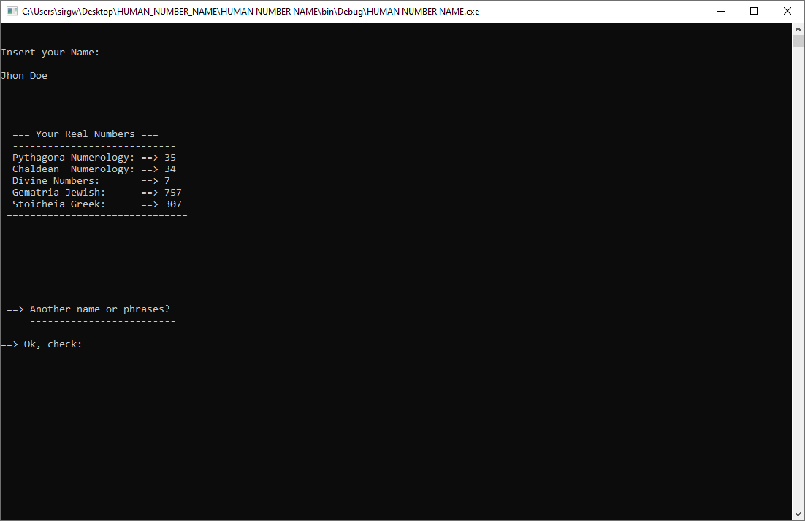

HUMAN NUMBER NAME - C# (version) - is professional numerology calculator write in c# language.

This project was originally written using JetBrains Rider , but I have migrated it to Visual Studio.

How is Work
---------------------

Go to >>> Human Number Name(folder) >>> bin >>> Debug >>> 
(double-click)HUMAN NUMBER NAME.exe

Insert your Name

Press --> Enter
and

Check your Results!!

Contributing
===============
If you run into an issue, we would be very happy if you would file a bug on the issue tracker.

We welcome contributions. For smaller changes just open a pull request straight away. For larger changes we recommend you open an issue first for discussion.

======================================================================

Donation Project
================

Project Name: Human.Number.Name C#(version)

Etherium: 0x14996EE0113C46A34b14e4F30197768b174c9486

Bitcoin: 1HN7eNRiJFWR1JXQdMx2hwVCaANmbhnUrb

Bitcoin Cash: qz7h44sqpn8ud2hv04tw2kgr9ayqu94gngm2tedvrt

Tipeeestream: https://www.tipeeestream.com/rob-giuliano/donation

License
========
Human Number Name is released under the terms of the Gnu/Gpl.

